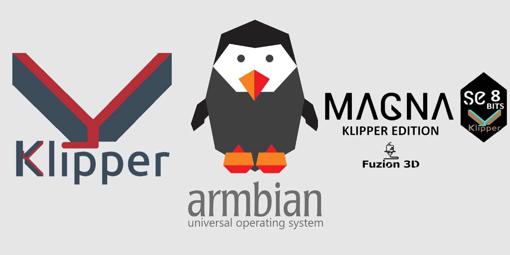

# 🚀 Armbian Klipper para Hellbot Magna - ¡Plug & Print!



¡Bienvenido a la solución definitiva para correr **Klipper** en tu **Hellbot Magna** sin dolores de cabeza! Esta imagen de **Armbian** viene **preconfigurada y lista para funcionar** en tu **Makerbase PI** [**Techforge**](https://techforge.com.ar/). Olvídate de configuraciones tediosas, solo graba, enciende y ¡a imprimir! 🎉

---

## 🔥 ¿Qué hace esta imagen tan especial?

- 🏎️ **Rápida y optimizada**: Basada en Armbian, diseñada para correr Klipper sin latencias innecesarias.
- 🎛️ **Klipper preinstalado**: Sin necesidad de configuraciones manuales, ya viene con todo lo necesario.
- 🖨️ **Configuración lista para la Hellbot Magna**: ¡Solo enciéndelo y empieza a imprimir!
- 🎯 **100% compatible con Makerbase PI**: No más dolores de cabeza con hardware.
- ⚡ **Plug & Print**: Lo más cercano a "enchufar y usar" en el mundo de las impresoras 3D.

---

## 🛠️ Instalación: ¡Tan fácil como hacer café! ☕

### 1️⃣ ¿Qué necesitas?

- 💾 **Tarjeta microSD** (mínimo 8GB).
- 💻 **Software para grabar imágenes** ([Raspberry Pi Imager](https://www.raspberrypi.com/software/) o [balenaEtcher](https://www.balena.io/etcher/)).
- ⚙️ **Makerbase PI lista para la acción.**

### 2️⃣ Graba la imagen como un pro

1. Descarga la imagen desde Mediafire (¡no te preocupes, es ligera!).

  .- [**Descarga Primera parte**](https://www.mediafire.com/file/1rhz5gqk1686p34/Klipper_Hellbot_Magna_SE_8bits_ByFuzion3d.part1.rar/file)

  .- [**Descarga segunda parte**](https://www.mediafire.com/file/edbu3pz20ouse0w/Klipper_Hellbot_Magna_SE_8bits_ByFuzion3d.part2.rar/file)

2. Usa tu software favorito para grabarla en la microSD.
3. Inserta la microSD en la Makerbase PI de [**Techforge**](https://techforge.com.ar/)

🔹 **Ejemplo de grabación con balenaEtcher:**

[Instalación con Etcher](https://www.balena.io/blog/content/images/2021/03/etcher.gif)

### 3️⃣ Arranca y comienza la magia

1. Conéctala a la fuente de alimentación y espera unos segundos.
2. Abre un navegador y escribe la dirección IP de tu Makerbase PI.
3. ¡Listo! Klipper está corriendo y esperando tus órdenes. 🤖

---

## 📁 Configuración y Archivos: ¡Todo en su lugar! 📂

- 📜 **Archivo de configuración `printer.cfg` ya incluido.**
- 🛠️ Lo encuentras en:
  ```
  /home/pi/klipper_config/printer.cfg
  ```
- Si quieres personalizarlo, edítalo directamente desde la interfaz web de Klipper.

---

## ❓ Preguntas Frecuentes (FAQ) 🤔

### 🔹 ¿Puedo usar esta imagen en otra placa Raspberry?
Compatibilidad con otras Raspberry Pi
**Raspberry Pi CM4** → Totalmente compatible, ya que la MKS Pi usa este módulo.

**Raspberry Pi 4B** → Parcialmente compatible, dependiendo de los controladores y la configuración del kernel.

**Raspberry Pi 3B / 3B+** → Poco probable, ya que usan una arquitectura diferente (Broadcom BCM2837 vs. BCM2711 en CM4).

**Raspberry Pi 2B, Zero, Zero 2 W, 1B+** → No compatible, por diferencias en hardware y arquitectura.


### 🔹 ¿Cómo accedo a la interfaz de Klipper?
🖥️ Abre un navegador y escribe la IP de tu Makerbase PI. (Si no sabes la IP, revisa la pantalla de la MakerbasePi.)

### 🔹 ¿Cómo actualizo Klipper o el firmware?
¡Muy fácil! Ejecuta este comando en la terminal:
```bash
cd ~/klipper
./scripts/update-klipper
```

---

## 📷 Galería de Instalación 🖼️
_Agrega imágenes del proceso aquí para que otros vean lo sencillo que es._


---

## 📜 Licencia y Créditos
Este proyecto es de código abierto bajo la licencia **MIT**. ¡Modifícalo, mejóralo y compártelo!

🛠️ **Creado con amor por la comunidad maker por Fuzion 3D!!.** 💙

¡Ahora ve y haz que esa Hellbot Magna SE 8 Bits imprima como nunca antes! 🚀🔥


